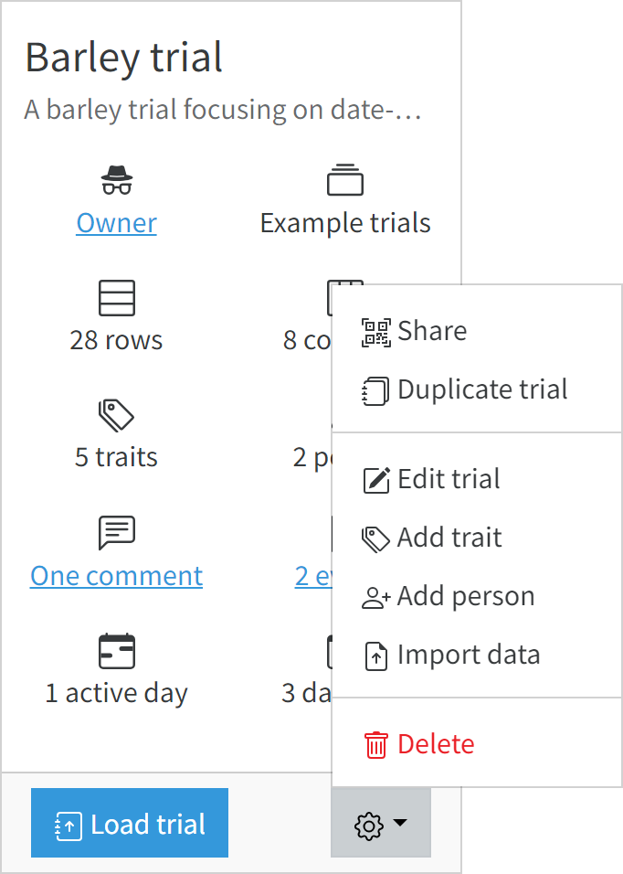

<!-- Use these horrible HTML tag attributes because Markdown only supports limited HTML/CSS -->

  

<a href="index.html" class="btn btn-dark">Home</a>

Contact us: [sebastian.raubach@hutton.ac.uk](mailto:sebastian.raubach@hutton.ac.uk) or [@germinatehub](https://www.twitter.com/germinatehub) on Twitter.

# Session 2: The GridScore User Interface

This tutorial will guide you through the main components of the GridScore interface. We will explain where you can create trials, collect data and visualize data as well as where to change settings and languages.

> Use your GridScore bookmark from the previous session or to go https://gridscore.hutton.ac.uk to follow along with this material.

## Navigation
All navigation items are found in the top bar of the GridScore interface. They allow the movement between different functionalities of GridScore like data input, data visualization and settings among others. Menu items with a caret pointing down (&#9660;) will show more menu items when clicked on. For example, clicking on `Visualizations` will reveal a sub-menu with different visualization options.

Below is a screenshot of the front page of GridScore. You can find the navigation menu along the top in dark blue. Clicking on the `GridScore NEXT` text in the top left will always take you back to this front page.
 

If you are using GridScore on a mobile device, the navigation menu may be hidden in the so-called "Hamburger menu", named after the icon with three horizontal bars that vaguely resembles a hamburger. Clicking on this button will expand or collapse the main navigation menu. The following screenshot shows what it looks like when the menu is expanded.

## Light/dark mode

GridScore lets you switch between a light and a dark mode. By default, the light mode is selected which allows for best visibility in bright environments. If you are working in darker environments, you might prefer the dark mode which reduces the brightness of the interface and is easier on the eyes. Use the `Toggle dark mode` button to switch between the two modes.

 Below are two screenshots that show different parts of the GridScore user interface on both light (left) and dark (right) mode.

## Language

GridScore supports different languages. By default, it'll start up in English, but you can (currently) switch to German or Vietnamese. You can see GridScore in German below. If you would like to see GridScore in another language, please get in touch and maybe you can help make it happen! We would like to include as many translations of GridScore as possible.

## Home page

The home page of GridScore is the first page you see when GridScore starts. It contains the most frequently used functionalities - the action buttons and the trial selector. The action buttons quickly let you do things like creating a new trial, importing a trial, loading an example trial or changing the settings.

The trial selector shows you all your trials that are available on your current device. You can filter and sort the list to search for specific trials and change the way they are displayed using the controls above the trial list.

Each trial is shown as a card with its name, description and some key characteristics like trial dimensions, number of traits and when it was last active. To start collecting data, look at visualizations or export data from a trial, select the trial first using the `Load trial` button.

For more options for each trial are available in the dropdown menu accessible from the cog icon in the bottom right. These include: sharing, duplicating or editing a trial, adding traits or people as well as importing pre-existing data and deleting the trial. Depending on your permissions on the trial, some of these options may not be available.

## Tasks:

1. 

How many languages is GridScore available in?
Answer: 3 - English, German and Vietnamese.

Next Steps:  We have learned a bit about the GridScore interface and where basic tools are located, now [let's have a look at creating a trial in Session 3](session-3.html).

<a href="index.html" class="btn btn-dark">Home</a>

> ## About
> This training is free to use and released under a non-restrictive open source licence.

  
  
  

