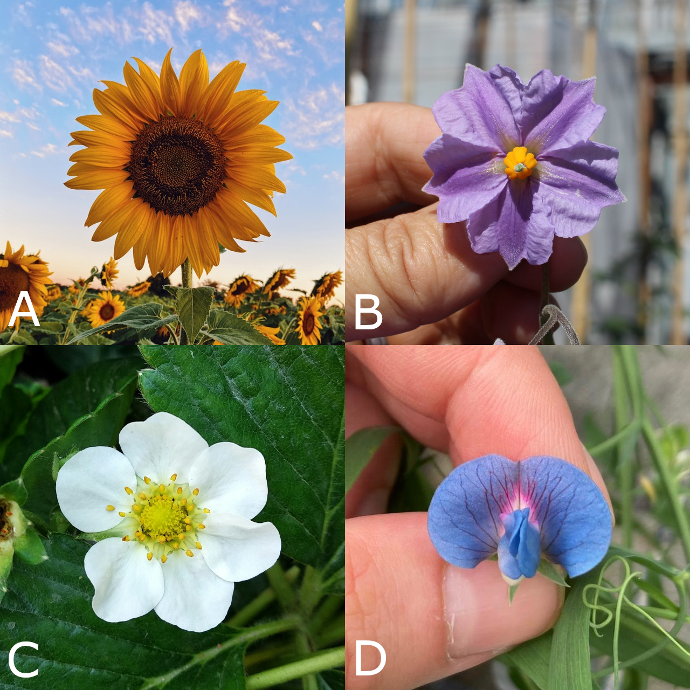

<!-- Use these horrible HTML tag attributes because Markdown only supports limited HTML/CSS -->
<p align="center">
  
</p>

<a href="index.html" class="btn btn-dark">Home</a>

Contact us: [sebastian.raubach@hutton.ac.uk](mailto:sebastian.raubach@hutton.ac.uk) or [@germinatehub](https://www.twitter.com/germinatehub) on Twitter.


# Session 3: Creating a trial

Now that we know where we can find everything in GridScore, let's create a new trial. To do this, return to the home page of GridScore by clicking on the logo in the top left corner. Then select the `Create new trial` card which will take you to the trial creation screen.

## Trial definition

The trial setup screen is where you would create a new trial from scratch. There are three things that are required to be provided to create a new trial: fdsfsf 

1. **Trial name**: A trial has to have a short but descriptive name. This can include the year/season as well as project abbreviations etc.
2. **Trial layout**: GridScore needs to know what the individual subjects are for which you want to collect data. Depending on your use case, these might be plots/pots of crops, individual wild specimen, laboratory samples or parking spaces at your local supermarket. Anything that you want to record data for basically.
3. **Traits**: These are the variables which you want to record for each subject along with their data type. As examples, these could be "plant height", "yield", "GPS location", "Disease resistance", "Growth type" or any other variable. Available data types include (among others) "numeric", "categorical", "date", "gps coordinates", "image" and "free text". We are continuously adding new data types based on requests coming in from our collaborators and users. If you can think of any additional data types you'd like to see, get in touch.

The other fields on this screen are optional, but we'll explain them now below:

- **Trial description**: If you want to provide more information about this trial to your collaborators you can add this here.
- **Trial group**: If you are likely to have a large number of trials running at the same time, grouping them makes them easier to manage and find the one you're looking for. As an example, you might want to group them by project, funder or collaborator.
- **People involved**: You can define the individuals involved in this trial along with their roles. If defined, people have to select their own name in the list when they're collecting data because their name will be associated with the recorded data.


The trial layout is specified by first defining the dimensions of the trial. This means entering the number of rows and columns of the trial. Remember that your use-case may not require a grid-like layout in which case you just specify one (1) column and as many rows as you have germplasm/subjects. In this example, we're setting up a really small trial with only two rows and two columns.

There are more options on this screen that let you change the numbering order for rows and columns as well as adjust row and column labels.


The next tab on the trial layout specification screen asks you to provide the identifiers for each plot/pot/cell. For each cell you are using, the `Name/Id` field is required while `Rep` and `Control/Check` are optional. Reps are often used in field trials where the same germplasm is used repeatedly. Controls and checks are also often included as a reference to a known germplasm to see how the rest of the trial compares to this reference.

There are various options to import this information rather than typing it in manually.


After the trial design has been specified, the traits/variables are next.

Below is a list of the options that can be specified here:

- **Trait name**: The display name chosen for this trait. This is used throughout the interface to represent this trait.
- **Trait description**: Optional description to go along with the trait. This could provide information about how exactly the trait should be measured and what unit to use.
- **Data type**: The dropdown lets you pick the data type of this trait, e.g. `Category`, `Whole number`, `Text`, etc.
- **Trait group**: Similar to the trial group, the trait group is used to group together traits that share some characteristics, whether this is the time frame of when they're scored or whether they're scored in the field versus the lab.
- **Category options**: For categorical traits, the valid values are specified in this text box - one per row/line. The data collectors will be able to choose one of these options.
- **Minimum**: For numeric traits, a minimum value can be specified. This value puts a strict lower boundary on any data that's entered and it won't be possible to enter a value lower than this minimum.
- **Maximum**: For numeric traits, a maximum value can be specified. This value puts a strict upper boundary on any data that's entered and it won't be possible to enter a value higher than this maximum.
- **Set size**: This value determines how many individual values need to be recorded for each germplasm/subject. For plot trials, this value could be set to the number of individual plants that need to be scored within the plot.
- **Allow repeated measurements**: When set to false, only a single value can be recorded for each germplasm/subject for this trait over the duration of the trial. If it needs to be possible to record multiple values, this should be set to true.
- **Timeframe restrictions**: As an aid for the data collectors, timeframes can be specified for each trait that indicate when a certain trait should be scored. This restriction can either be enforced or suggested. The former prevents data input outwith the timeframe while the latter only shows a warning.

The trait list on the right side shows all the traits that have already been defined. These can be reordered, modifier and deleted if required.


## Create a new trial

Try and create a new trial with a 2x2 grid same as the image below.



Name the plots/subjects `A`, `B`, `C` and `D`.

Then define the following traits:

- **Flower colour**: `Category` with options
  ```
  white
  red
  pink
  purple
  orange
  blue
  ```
- **Flower shape**: `Category` with options 
  ```
  cruciate
  rotate
  funnelform
  campanulate
  bilabiate
  papilionaceous
  ```
- **Petal count**: `Whole number` with minimum `0` and maximum `100`.
- **Plant height**: `Whole number` with minimum `0` and maximum `200`.
- **Crop**: `Category` with options
  ```
  barley
  grasspea
  potato
  raspberry
  rice
  strawberry
  sunflower
  tomato
  ```


Enter an arbitrary trial name and create the trial.

## Tasks:
### Click on the questions to reveal the answers or more information.

1. <details><summary>What are the three things that need to be specified for each trial?</summary>1. The trial name, 2. the trial layout and 3. the traits.</details>
1. <details><summary>If your data collection use-case doesn't use a grid-like layout, how many columns and rows should you specify?</summary>Only a single column and as many rows as there are subjects should be specified.</details>
1. <details><summary>Can you name at least three available trait data types?</summary>Whole number, Decimal number, Category, Date, GPS coordinate, Image, Free text</details>
1. <details><summary>What does the "set size" determine for a trait?</summary>It specifies how many individual measurements for a plot/subject should be collected. For example, a value of 3 for a barley plot trial indicates that three individual barley plants should be evaluated.</details>

Next Steps:  We have learned a bit about how to create a trial, now [let's have a look at how to collect data in Session 4](session-4.html).

<a href="index.html" class="btn btn-dark">Home</a>

> ## About
> This training is free to use and released under a non-restrictive open source licence.

<div class="logos">
  
  
  
</div>