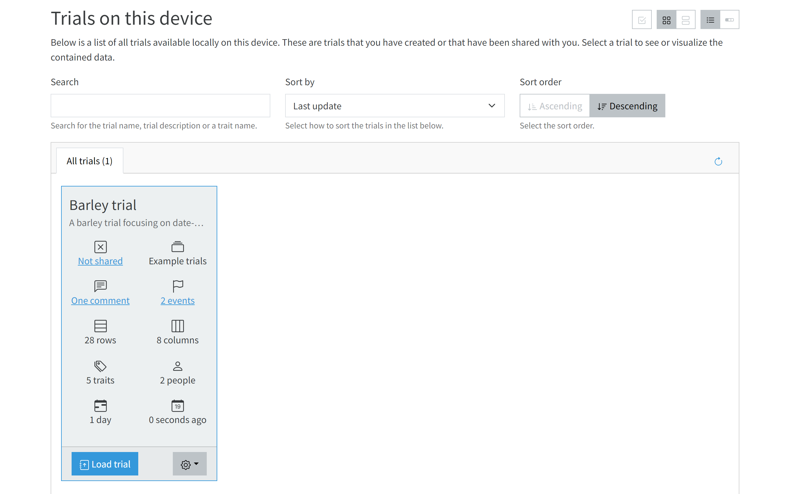

<!-- Use these horrible HTML tag attributes because Markdown only supports limited HTML/CSS -->

  

<a href="index.html" class="btn btn-dark">Home</a>

Contact us: [sebastian.raubach@hutton.ac.uk](mailto:sebastian.raubach@hutton.ac.uk) or [@germinatehub](https://www.twitter.com/germinatehub) on Twitter.

> GridScore is available at https://gridscore.hutton.ac.uk

# Session 4: Collecting data

To collect data for a trial, start by selecting it from the home page using the `Load trial` button of the respective trial.

## Data input screen

This will take you to the data entry page of GridScore which shows your trial layout where each cell is one of the plots/subjects you defined during your setup. The text in the cell is the name/id of the germplasm/subject while the circles represent the traits. Empty circles mean that no data has been collected yet while filled or semi-filled circles indicate present data. In this example, checks/controls have been defined which are highlighted as blue plots.

## Recording data

To collect data for a plot/subject simply click on it.

The data input screen shows an input section for each trait. In this case, trait groups have been defined and the traits are separated into tabs according to their grouping. The first group includes date-based traits like "Awn tipping", "Heading" and "Maturity". For each one, you can select the date on which that event has taken place for the selected plot/subject.

Switching to the second tab ("Pre-harvest"), we can see the trait "Plant height" which has a set size of 3 meaning that three individual plants have to be measured for this plot.

The last tab ("Characterisation") contains a single categorical trait which asks you to choose whether the barley plants within the plot are 2-row or 6-row barleys.

After selecting the `Save` button, the main display will update and how show filled circles for all traits of plot `Dialog-2` which means that all required data for this plot has been collected.

The more data you collect, the more colourful the data display is going to be which acts as a progress indicator for the whole data collection process. In the image below you can see that most plots have been scored for most traits. There are a few measurements still missing for the last trait ("Row type") as indicated by the empty bright green circles.

## Tasks
### Click on the questions to reveal the answers or more information.

1. 

What are the plot/subject selection methods to open the data input window?
Clicking on a cell, scanning a barcode or using the guided walk.

1. 

How are trait groups represented in the data input windows?
They are shown as tabs.

1. 

How is collected data indicated on the data display?
Collected data is shown as filled or semi-filled circles, missing data as empty circles.

1. 

How are controls/checks highlighted?
They are highlighted in blue and they have a checkbox icon in the bottom right corner.

Next Steps:  We have learned a bit about collecting data with GridScore, now [let's have a look at visualizing that data in Session 5](session-5.html).

<a href="index.html" class="btn btn-dark">Home</a>

> ## About
> This training is free to use and released under a non-restrictive open source licence.

  
  
  

